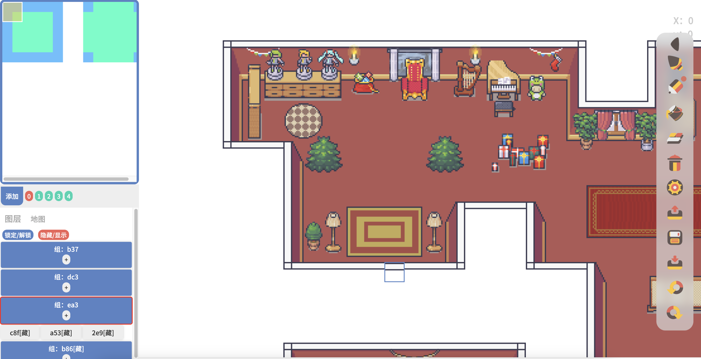

# 食用(✺ω✺)说明 Eating?! Introduction

> 如果你是萌新，请务必仔细阅读使用说明哈~
If you are new-player, read me carefully please~
注意这个项目还是测试版，也许有层出不穷的bug，请不要用于生产环境（请仔细阅读本文文末的提示）
Attention this project is a beta version for testing. May be lots of Bug. Please don't use for production environment.

## 必须准备的环境 Environment Preparation

1. 安装 [node.js](https://nodejs.org/en/)
2. 叮咚，没啦。

---

1. install [node.js](https://nodejs.org/en/)
2. DingDong,no another steps, that's Right!

## 开箱 Open Box

1. 下载本项目，你可以用各种奇怪的方法，不过最傻瓜的方法莫过于点击【code】按钮，然后点击【Download Zip】
Download this project.It is fool-easy-way that click code button and then click Download Zip button after the pop-up notification.You can alse use any strange way.

2. 当然你也可以使用git的克隆命令，前提需要安装[git](https://git-scm.com/)。
`git clone git@github.com:0ui0/icat_gameMapEditor.git`
Sure, git clone is anothor best choise. But you have to install git in you computer.

3. 解压下载的压缩包，进入到项目文件夹“icat_gameMapEditor”下
Extract archive,and change directory into icat_gameMapEditor.

4. 使用命令行工具cd到该文件夹(cd命令使用请参考后面的说明)，然后执行`npm install`，npm命令会在你安装nodejs后自动被安装上，然后等待命令执行完毕。
这个命令会自动安装项目所需要的的依赖库。
Change directory at the folder, and run command `npm install` in your terminal, npm will be installed after installing nodejs.And wait for it complete.

5. 继续使用命令行工具执行`node serve.js`命令，启动应用服务器，看到下面的提示说明启动成功：
`server start at http://:::8721`

Run command `node serve.js`.
It will run app server in port 8721. 
It indicate run sucess, if you see the tips below:
`server start at http://:::8721`

6. 在浏览器的地址栏输入默认访问地址：`http://localhost:8721`，即可看到我们的地图编辑器啦。注意此时不要关闭命令行窗口哦。
Enter the url in your browser `http://localhost:8721`, yeah, it is our map editor! Be careful don't close the command window.

## 【提示】常用命令参考和命令使用说明：

> 我要在哪里输入指令呢？

使用“win徽标键+R键”，可以打开“运行”对话框，在弹出的对话框内输入“cmd”，点击“确定”，就可以启动命令行工具啦。在命令行工具里，每输入完一个命令需要按回车（Enter）来执行。

> 学习使用进入文件件的`cd`命令

在命令行界面，使用cd命令可以进入一个文件夹。格式为：`cd 文件夹或者目录路径`
比如`cd d:\我下载的奇怪游戏`
这就会进入到D盘下的【我下载的奇怪游戏】文件夹内，当然前提是有这个文件夹哈
注意如果文件夹的名字含有空格，需要对整个路径加一个英文半角的引号。
如果你使用linux或mac系统，注意它们的路径的斜杠和windows系统是相反的
比如在linux下的路径会是这样的：`/home/user/我下载的奇怪游戏`

那么，所谓cd，顾名思义：
change directory = 切换目录

> 学习使用返回上级文件的`cd ..`命令

输入`cd ..`可以从当前目录返回上一级的目录，注意cd和点的中间有一个空格。

> 已经进入文件夹了，如何查看文件夹里的文件呢？

使用`dir`命令，可以列出当前目录下的文件列表，如果你使用linux，可以换成`ls`命令。

> 学习使用node命令。

如果你已经成功安装完了nodejs，系统就会自动帮你安装上node命令和npm命令。这两个命令都可以在命令行工具内使用。
那么，使用cd命令进入到你下载并解压的我们的项目目录内，例如：
`cd d:/我的奇怪游戏/icat_gameMapEditor`

提示1：在资源管理器的地址栏可以快速复制当前文件夹的地路径哦。
提示2：在命令行工具右键就可以粘贴。

然后我们使用`dir`(windows系统)或`ls`（linux或mac系统）命令，列出目录下的文件列表，可以看到目录里有一个serve.js文件。

对没错，根据前前前面的说明，我们就要用node执行它啦：
`node serve.js`

> npm命令说明。

npm是nodejs的包管理器，你可以理解为node程序的自动插件安装器。当我们执行`npm install`命令的时候，npm程序会自动根据当前文件夹里面的package.json文件记录的数据去安装当前项目所需的依赖插件。

## 功能说明 How to use?

> 我想经过简单的探索，学会使用基本功能应该没有什么困难啦。这里特别说明一下‘自动元件’功能。

1. 使用自动元件必须指定包括1个地面块，4个边块，4个角块，4个交叉角块在内的13个图块。
2. 先点击左侧菜单的图块，再点击右边对应的图块按钮，即可设置目标图块对应的素材图里的坐标
3. 全部设置完毕以后，切换到”画笔“，既可以开始绘制。
4. 注意，成功绘制完一个路面，需要全部框选，编组后才可以绘制下一个路面，否则绘图器会将当前已经绘制完毕的路面纳入下一次判定，导致绘制异常。

## 一些问题 Some Problem
图片素材导入功能是直接formdata的，如果图片比较大会很卡。方便的话可以直接前往/www/src/view/gameEditor/gameEditor_data.js修改里面的图片素材路径的配置，自行将图片素材放置到所需要的路径。
其余配置包括初始图块尺寸也可以在本文件内修改。

## 交流社区 Discuss
https://www.o-o.space/#!/home/4312

## 各种各样的Bug和问题 Lots of Bugs and Problems

我知道一定有各种各样的Bug，嗯。……
但是尤其需要注意的是
目前这个绘图器缺少【存档】功能，【撤销】功能，请不要用于生产环境的大地图绘制，否则万一程序出错数据就找不回来了。这些功能我会在后续陆续完善。

missing SAVE function
missing UNDO function

